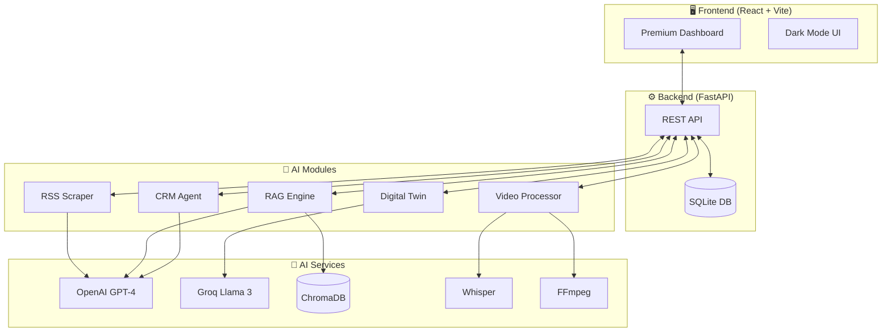

<div align="center">

# 🚀 Autonomous AI Coaching Ecosystem

[](https://python.org)
[](https://fastapi.tiangolo.com)
[](https://react.dev)
[](https://openai.com)
[](LICENSE)

**A full-stack AI automation platform for high-ticket coaching businesses.**

*Multi-agent systems • RAG knowledge base • Video processing • CRM automation*

</div>

---

## 📋 Overview

A comprehensive AI ecosystem that combines multi-agent systems, RAG (Retrieval Augmented Generation), and video processing into a unified dashboard. Designed specifically for coaches, consultants, and course creators who want to scale their business with AI automation.

---

## 🌟 Modules

<div align="center">

| Module | Name | Description |
|:------:|------|-------------|
| 🧠 **A** | Speaker Sourcing | Automated podcast scraping & guest outreach |
| 🤖 **B** | AI Coach (RAG) | 24/7 conversational agent with knowledge base |
| 🎬 **C** | Content Engine | Viral clip detection & video processing |
| 📧 **D** | Outreach & CRM | Multi-step campaigns & webhook automation |
| 🖥️ **F** | Dashboard | Premium React UI with dark mode |
| 📱 **G** | Digital Twin | WhatsApp/Telegram chatbot API |

</div>

---

## 🏗️ System Architecture



---

## ✨ Module Details

### 🧠 Module A: AI Speaker Sourcing

| Feature | Description |
|---------|-------------|
| **RSS Monitoring** | Automated scraping of podcast feeds |
| **Guest Analysis** | LLM-powered bio extraction & relevance scoring |
| **Outreach** | Hyper-personalized invitation emails |

### 🤖 Module B: AI Coach (RAG)

| Feature | Description |
|---------|-------------|
| **Knowledge Ingestion** | PDFs, transcripts, manuals |
| **Semantic Search** | ChromaDB vector database |
| **24/7 Chat** | Conversational agent for client Q&A |

### 🎬 Module C: Viral Content Engine

| Feature | Description |
|---------|-------------|
| **Video Upload** | Drag & drop long-form content |
| **AI Clipping** | Identifies viral moments via sentiment analysis |
| **Export** | FFmpeg cuts ready for TikTok/Reels |

### 📧 Module D: CRM & Outreach

| Feature | Description |
|---------|-------------|
| **Email Sequences** | Multi-step campaigns with delays |
| **Webhook Listener** | GoHighLevel integration |
| **Follow-up Automation** | AI-triggered task creation |

### 📱 Module G: Digital Twin API

| Feature | Description |
|---------|-------------|
| **Chatbot API** | WhatsApp/Telegram endpoint |
| **Style Mimicking** | Replicates your coaching voice |

---

## 🛠️ Tech Stack

<div align="center">

| Layer | Technologies |
|-------|--------------|
| **Backend** |    |
| **Frontend** |    |
| **AI/ML** |    |
| **Media** |   |

</div>

---

## 🚀 Quick Start

### Prerequisites

- Python 3.9+
- Node.js 18+
- API Keys: OpenAI, Groq (optional)

### 1️⃣ Clone & Setup

```bash
git clone https://github.com/surbalo1/ai-coaching-system.git
cd ai-coaching-system

# Create environment file
cp .env.example .env
# Add your keys: OPENAI_API_KEY=sk-...
```

### 2️⃣ Run Backend

```bash
# Install dependencies
pip install -r requirements.txt

# Start FastAPI server
python3 -m uvicorn app.main:app --reload
```

📍 **API Docs:** http://localhost:8000/docs

### 3️⃣ Run Frontend

```bash
cd frontend
npm install
npm run dev
```

📍 **Dashboard:** http://localhost:5173

---

## 📁 Project Structure

```
ai-coaching-system/
├── 🐍 app/                    # FastAPI backend
│   ├── main.py                # Entry point
│   ├── routers/               # API endpoints
│   ├── services/              # Business logic
│   └── models/                # Data models
│
├── ⚛️ frontend/               # React + Vite
│   ├── src/
│   │   ├── components/        # UI components
│   │   ├── pages/             # Route pages
│   │   └── services/          # API client
│   └── package.json
│
├── 📁 data/                   # Knowledge base files
├── 🗄️ database.db             # SQLite database
├── 📄 requirements.txt        # Python dependencies
└── 📄 .env.example            # Environment template
```

---

## 🔧 Verification Scripts

Test each module independently:

```bash
python verify_rss.py      # RSS scraping
python verify_rag.py      # RAG knowledge base
python verify_crm.py      # CRM integration
python verify_twin.py     # Digital twin API
python verify_outreach.py # Email outreach
python verify_full.py     # Full system test
```

---

## 💡 Use Cases

- **Coaches** - Automate client onboarding & Q&A
- **Course Creators** - 24/7 student support
- **Consultants** - Scale outreach & lead nurturing
- **Podcasters** - Guest sourcing & content repurposing

---

## 📄 License

MIT License - see [LICENSE](LICENSE) file.

---

<div align="center">

**Built with ❤️ for coaches & creators**

[](https://github.com/surbalo1/ai-coaching-system)

</div>
